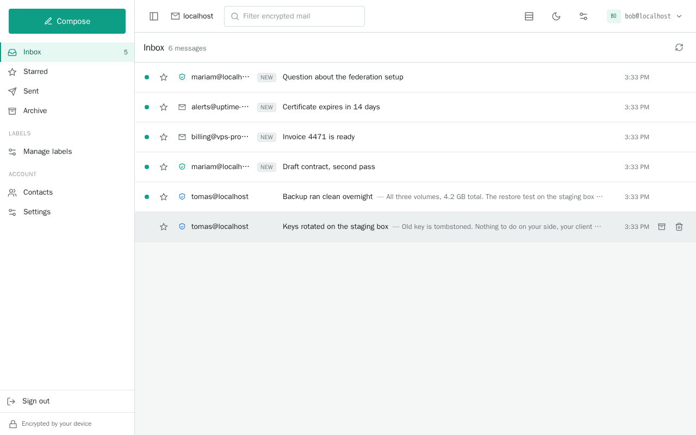
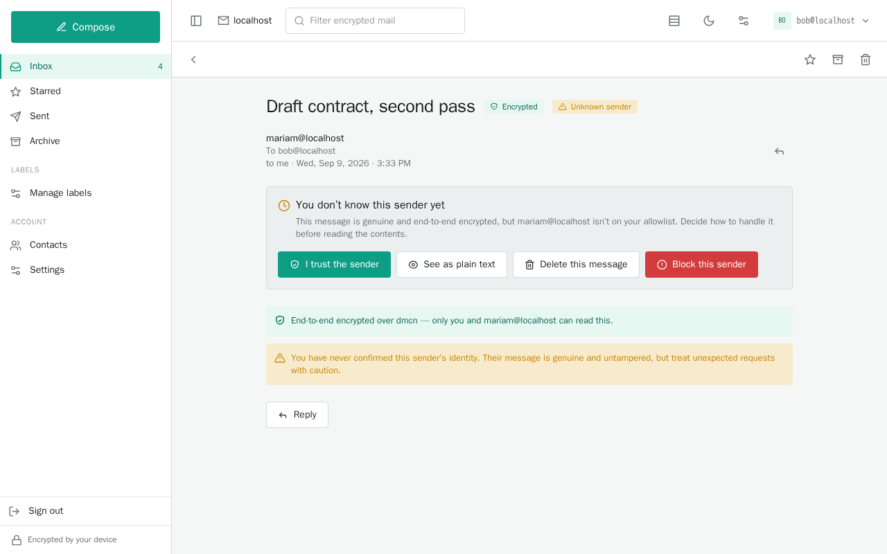

# open-dmcn

The open core of the **DMCN Protocol (DMCNP)** — the protocol spoken by **DMCN**, the
Decentralized Mesh Communication Network: a peer-to-peer, end-to-end-encrypted
store-and-forward mail network where **cryptographic identity replaces SMTP-style
trust**. DMCN names the network; DMCNP names the protocol specified here.

This repository is the **canonical home of the core protocol schema** AND a complete,
single-binary **reference implementation** (`dmcnd`): everything an independent
implementation needs to interoperate — resolve addresses, verify identities, send and
receive mail — plus a runnable server that does it. It deliberately contains **no product
machinery**: operator fleet administration, hosting permits, provisioning, entitlements
and client-convenience surfaces are extensions maintained elsewhere (they ride their own
libp2p protocols and a generic, signature-covered extension surface — see SPEC.md §8).

## Reference daemon (`dmcnd`)

`cmd/dmcnd` is the reference implementation of the whole core protocol as **one process
for one domain** — where the product splits into a relay fleet, a separate stateless web
client, a provider funnel and a bridge, `dmcnd` folds the serving node, the webmail, the
SMTP bridge and the onion transport into a single self-hostable binary.

It is **zero-knowledge**: the browser generates the keypair, self-signs its identity record
and signs every operation, and only the signed *public* record ever reaches the server. The
daemon holds no account private key — not even an encrypted one. The only keys it mints are
the domain's own: the root key behind its authority record, and the SMTP bridge's identity
when the bridge is enabled.

What it is:

- a **serving node** — durable mailbox + local record store + relay (`/dmcn/relay/1.0.0`,
  `/dmcn/peers`, `/dmcn/join`), authoritative for its own domain;
- a **webmail client** — the React SPA is embedded (`//go:embed`); all crypto is
  client-side (Web Crypto), the backend is an in-process proxy to the node. It is the same
  application the hosted product ships, differing only where a deployment genuinely must:
  `src/lib/deployment.ts` declares those points and `src/deployment.tsx` fills them in for
  this build. What that buys is a client whose trust code has one implementation rather than
  two that slowly disagree — but note the direction of the trade: this build verifies a
  bridge's attestation **in the browser**, against the domain root key published in DNS, so
  nothing about whether a bridged message looks trustworthy passes through the server;
- **self-service registration** — the browser generates keys and self-signs its record;
  the daemon attaches an operator routing credential and publishes it;
- an optional **SMTP bridge** (`DMCND_BRIDGE_ENABLED`) — inbound legacy email is verified with
  real SPF/DKIM/DMARC, then signed+encrypted into DMCN mailboxes with the verdict attached as a
  signed attestation; outbound DMCN→SMTP is captured in memory until you opt in with
  `DMCND_BRIDGE_DELIVERY_MODE=smtp`, so a fresh install never sends live mail;
- **onion routing** — inherited transport, inert until the mesh has ≥3 relays.

### What it looks like



A verified sender is one whose identity record the client resolved and checked itself — not a
provider's opinion about them, and not something the server can assert on their behalf.



The distinction ordinary email cannot draw. This message is cryptographically genuine — signed
by the key that owns that address, untampered in transit — and that is *still* not a reason to
trust it, because you have never confirmed who holds the key. So the contents wait for you to
decide. Accepting the sender reveals the message and marks them trusted from then on.


On a live domain there is no sign-up form, because there is no key on the server that could
create an address. The browser makes the keys and shows a code; you read it to the admin, who
picks the address and signs it with a root key kept off the machine entirely.


### Run it with Docker

The fastest look, with nothing installed and nothing persisted:

```bash
docker run --rm -p 8080:8080 -e DMCND_DEV=true ghcr.io/dmcnp/open-dmcn
# → http://localhost:8080 — register an address and send yourself mail.
```

For a real domain, `compose.yaml` in this repo is the starting point:

```bash
curl -O https://raw.githubusercontent.com/dmcnp/open-dmcn/main/compose.yaml
# edit DMCND_DOMAIN, then
docker compose up -d
```

The image is a distroless static build — one binary, no shell, no package manager — running
as an unprivileged user (uid 65532), built for `linux/amd64` and `linux/arm64`. Tags track
releases (`:latest`, `:0.13`, `:0.13.4`).

Because it does not run as root, binding 443 or 25 needs
`net.ipv4.ip_unprivileged_port_start=0` — a per-container sysctl that changes nothing on the
host, and which `compose.yaml` sets for you. The dev command above needs none of it: it
serves on 8080 and keeps its state inside the container.

State lives in a named volume, which Docker seeds from the image with the right ownership, so
there is nothing to chown. The only bind mounts are read-only, for the two files you supply
if you run the bridge — the DKIM key and the bridge credential — which do need to be readable
by uid 65532.

It deliberately does **not** contain `dmcndcli`. That tool holds your domain root key, and
the live-domain design exists precisely so the root never sits on the node; install it on
the machine you administer from. The one operator command the node itself needs,
`dmcnd peer-id`, is built into the daemon.

On a live domain the container will start, report that it has no authority record, and wait
— serving nothing until you publish one from your admin machine. That is intended; the
startup log prints the exact command.

### The operator CLI as a container

`dmcndcli` is packaged separately, so administering a domain needs no Go toolchain and puts no
binary on your machine:

```bash
docker run --rm -it \
  -v "$PWD:/work" --user "$(id -u):$(id -g)" \
  ghcr.io/dmcnp/open-dmcn-cli domain init --domain mesh.example \
    --seed /ip4/203.0.113.7/tcp/7400/p2p/<peer-id>
```

The command is the native one with a `docker run` prefix, so nothing about the ceremony changes.
`--user` makes `root.enc` and friends belong to you rather than to root; `/work` is the working
directory, so everything it produces lands in the directory you ran it from.

Unlike the daemon image this one has a shell, because it is short-lived and yours: `--entrypoint
sh` when you would rather sit in the container and look at what the ceremony wrote.

**Run it on your admin machine, not on the node.** It mints and holds the domain root key, and
the whole point of the live-domain design is that the key never sits on the internet-facing
host. A container does not change that — the same host means the same disk. If `dmcnd` is on a
VPS, this belongs on your laptop, reaching the node over the network with `--peers` (libp2p)
and `--url` (HTTPS).

And to be clear about what it is not: since the keystore has to be mounted in for the tool to
be useful, this is **not** a sandbox that protects the key from the program. It buys you no
toolchain, nothing installed system-wide, a filesystem view limited to what you mount, and a
version you can pin.

### Build & run

The quickest way in — no clone, no Node, because the SPA is embedded in the binary:

```bash
go install dmcn.dev/open-dmcn/cmd/dmcnd@latest
go install dmcn.dev/open-dmcn/cmd/dmcndcli@latest   # operator CLI

# Both report the version they were installed at (`dmcnd version`) — from the module version
# when installed this way, or from git describe when built with `make build`.

# Dev: plain HTTP on localhost (a secure context for Web Crypto) and DNS anchoring stubbed,
# so a throwaway domain works without publishing real records.
DMCND_DEV=true dmcnd
# → open http://localhost:8080 in dev (https://<domain> in production);
#   the daemon prints the exact URL on startup. Register at /register.
```

From a clone:

```bash
make build                 # builds the embedded SPA (needs Node 20+) then bin/dmcnd
# or, since cmd/dmcnd/web/dist is committed:
go build -o bin/dmcnd ./cmd/dmcnd
```

Prebuilt archives for Linux, macOS and Windows (amd64 and arm64) are attached to each
[release](https://github.com/dmcnp/open-dmcn/releases); `make build-release` produces the
same set locally.

`web/dist` is committed on purpose: it makes `go build ./...` work from a clean clone
without Node, and it is what lets `go install` produce a working daemon (the module zip
carries it, so `//go:embed web/dist` resolves for anyone installing from the proxy). Run
`make build-web` (or `make proto-web`) to regenerate it.

### Configuration (`DMCND_*` environment)

| Variable | Default | Purpose |
|---|---|---|
| `DMCND_DOMAIN` | `localhost` | the DMCN domain addresses belong to (`user@<domain>`) |
| `DMCND_WEB_HOST` | `$DMCND_DOMAIN` | hostname the web client is served on and certificated for — set it to serve webmail at `mail.example.com` while addresses stay `user@example.com`. Never affects addresses |
| `DMCND_LISTEN` | `:443` (`:8080` in dev) | webmail listen address — 443 because autocert's ACME challenge only works there; dev serves plain HTTP, so it defaults off an HTTPS-conventional port |
| `DMCND_NODE_LISTEN` | `/ip4/0.0.0.0/tcp/7400` (ephemeral in dev) | libp2p listen multiaddr — this port goes into your published `seed=`, so it must be stable |
| `DMCND_ANNOUNCE_ADDR` | detected | multiaddr(s) other domains should reach this node at, when the bound address is not the reachable one (a NAT'd cloud VM). Replaces detection; these go into every routing credential this node issues |
| `DMCND_DATA_DIR` | `data` | mailbox/record store, sessions, node key, petition queue |
| `DMCND_IDENTITY` | `<data-dir>/node.key` | persistent libp2p identity key — the peer ID is published in DNS, so it must survive restarts |
| `DMCND_PETITION_TTL` | `24h` | how long an unclaimed mailbox petition survives |
| `DMCND_TLS_CERT` / `DMCND_TLS_KEY` | — | TLS cert/key; absent + not dev ⇒ autocert |
| `DMCND_DEV` | `false` | plain-HTTP-on-localhost + stub DAR DNS anchoring |
| `DMCND_PEERS` | — | bootstrap/discovery peer multiaddrs (federation) |
| `DMCND_ALLOWED_PEERS` | `*` in dev, else deny | libp2p federation allow-set (`*` = open) |
| `DMCND_STATIC_DNS` | — | static `_dmcn` pins for peer domains (DNS-free federation / seed-pin) |
| `DMCND_POLL_INTERVAL` | `10s` | webmail mailbox poll cadence |
| `DMCND_SEED_PASSPHRASE` | `dmcnd-dev-seed` | encrypts the DEV domain root keystore. A live daemon never creates a keystore, so this applies to dev only |
| `DMCND_BRIDGE_ENABLED` | `false` | fold in the SMTP bridge |
| `DMCND_BRIDGE_SMTP_LISTEN` | `:25` (`:2525` in dev) | bridge SMTP listen address — 25 is the only port sending mail servers try, and needs the same `CAP_NET_BIND_SERVICE` as `:443` |
| `DMCND_BRIDGE_CREDENTIAL` | — | the bridge's root-signed `bridge` credential (`dmcndcli bridge issue`). Without it the bridge runs but its verdicts are unverifiable |
| `DMCND_BRIDGE_DOMAIN` | `<domain>` | the legacy (SMTP) domain the bridge represents |
| `DMCND_BRIDGE_AUDIT_LOG` | — | append-only JSON audit log path |
| `DMCND_BRIDGE_AUTH_MODE` | `dns` | inbound verification: `dns` (real SPF/DKIM/DMARC) or `stub` (no checks — offline dev only) |
| `DMCND_BRIDGE_DELIVERY_MODE` | `stub` | outbound: `smtp` (real MX lookup + STARTTLS) or `stub` (captured in memory, sends nothing) |
| `DMCND_BRIDGE_DKIM_KEY` | — | PEM private key for outbound DKIM signing (`dmcndcli bridge dkim-keygen`); without it outbound mail is unsigned and widely spam-filtered |
| `DMCND_BRIDGE_DKIM_SELECTOR` | `dmcn` | DKIM selector (the `<selector>._domainkey` label) |
| `DMCND_BRIDGE_HELO` | `$DMCND_WEB_HOST`, else the domain | EHLO name announced to remote MTAs — must be a FQDN whose PTR matches, so it defaults to the host rather than the OS hostname |
| `DMCND_BRIDGE_SEND_IPS` | — | public addresses this bridge sends from (comma-separated, v4 and v6), so the DNS records printed at startup are pasteable |

### What syncs between devices

Mail lives in the mailbox on the relay, and so does per-account state — contacts, Sent,
read/unread, labels and settings — held in the relay's **personal storage**, sealed to the owner
so the relay stores ciphertext it cannot read. Sign in elsewhere and both follow you.

A relay may decline to offer storage (no datastore, or a deliberately minimal node). It answers
`UNSUPPORTED` and the client keeps that state in IndexedDB instead — single-device, still working.

### Federation

Two daemons on different domains interoperate the way email does — via DNS, not a global
DHT. Each publishes a `_dmcn.<domain>` TXT record (fingerprint + libp2p seed multiaddrs);
a sender resolves the recipient's domain, dials a seed, fetches the signed record, and
STOREs to the recipient's relay. In a dev/pinned cluster with no live DNS, list the peer
domains' anchors in a `DMCND_STATIC_DNS` file instead. Records are self-certifying, so a
wrong or hostile fleet is a denial-of-service risk, never a forgery vector.

### Operator CLI (`dmcndcli`)

Binding `:443` as a non-root service user needs `setcap CAP_NET_BIND_SERVICE=+eip $(command -v
dmcnd)` or systemd's `AmbientCapabilities`; the daemon checks at startup and says so rather than
failing after a clean-looking boot.

Every command below that touches the root key prompts for its passphrase when it is not supplied.
For scripted use set `DMCND_ROOT_PASSPHRASE` rather than passing `--passphrase`: a value in `argv`
is readable via `ps` by anyone else on the machine, and lands in shell history too.

`dmcndcli` runs on a **different machine from the node** — ideally one that stays offline. It
holds the domain root key, and the node never does: the node is given a signed authority record
and has no way to mint an address by itself, so breaching it does not let an attacker create or
re-point mailboxes. A live daemon serves nothing until it has been handed that record, rather than
falling back to minting a root for itself.

```bash
# Bring a domain into existence: mint the root HERE and sign its authority record, then print
# the DNS record to publish. Touches no network.
dmcndcli domain init --domain mesh.example \
  --seed /ip4/<public-ip>/tcp/7400/p2p/$(ssh node dmcnd peer-id) \
  --keystore root.enc
#   → _dmcn.mesh.example.  TXT  "dmcn-verification=v1; fp=<40-hex>; seed=/ip4/…/p2p/…"

# Hand that record to a running daemon, which serves nothing until it has one. Sends only the
# signed public record — the root key stays here. Safe to re-run.
dmcndcli domain publish --domain mesh.example --peers /ip4/<host>/tcp/7400/p2p/<peer-id>

# Reprint the DNS record from the existing root — new seed address, moved node. Mints nothing.
# --bridge advertises which peer carries mail to/from the legacy email world (the DMCN analogue
# of an MX record); without it your users cannot send to ordinary email addresses.
dmcndcli domain dns --domain mesh.example \
  --seed /ip4/<new-ip>/tcp/7400/p2p/<peer-id> --bridge /ip4/<new-ip>/tcp/7400/p2p/<peer-id>

# Give someone a mailbox. They petition from the web UI and read you the 12-digit code out of
# band; that contact IS the authorization. They do not choose their address — you do.
dmcndcli petition assign --code 0428-9173-5560 --address alice@mesh.example \
  --url https://mesh.example --keystore root.enc

# Generate the outbound DKIM key and print the SPF/DKIM/DMARC records to publish. Touches no
# network and no domain root — this is the bridge's key, not the domain's.
dmcndcli bridge dkim-keygen --domain mesh.example --host mail.mesh.example \
  --ip <public-ipv4> --ip <public-ipv6> --out dkim.pem

# Free an address whose key was lost, compromised or squatted, so it can be bound again.
# Root-only, and the ONLY recovery path: the daemon refuses any record that re-binds a live
# address to a different key unless the domain root has tombstoned the incumbent.
dmcndcli remove-address --address alice@mesh.example --peers /ip4/127.0.0.1/tcp/7400/p2p/<peerID>
```

On the node itself, `dmcnd peer-id` prints its libp2p peer ID (creating the key if missing) —
that is the only thing you need from the node in order to sign its domain's authority record.

## Layout

```
cmd/dmcnd/         the single-binary reference daemon (+ embedded web/ SPA)
internal/          the reference implementation (no API-stability promise):
  core/{crypto,identity,message,onion,domainverify,mailfilter}
  {node,relay,registry,keystore,peerpolicy,bridge,web,webcore,p2plog}
proto/
  identity.proto   dmcn.identity — identity records, credentials, domain authority,
                   blocklists, removals, fleet rosters, relay descriptors
  message.proto    dmcn.message  — the three-layer message model + encrypted envelope
  relay.proto      dmcn.relay    — the /dmcn/relay/1.0.0 wire protocol (mail interop)
  bridge.proto     dmcn.bridge   — OPTIONAL capability: SMTP-bridge attestation payloads
dmcnpb/            generated Go (committed; import dmcn.dev/open-dmcn/dmcnpb)
SPEC.md            the protocol reference (a snapshot of the reference implementation)
site/              dmcn.dev source: markdown content, templates, design system,
                   and the generator (a SEPARATE Go module — see below)
docs/              GENERATED dmcn.dev output, committed and published by Pages
```

`bridge.proto` is an **optional capability** like onion routing: a conforming
implementation need not run an SMTP bridge, but if it does, these are the attestation
formats (they are end-to-end-sealed message payloads, not wire ops).

## Schema rules

- **Never reuse a reserved field or arm number.** Vacated numbers carry `reserved` +
  gravestone comments; they are part of the protocol's history.
- **Breaking checks are PACKAGE-level** (`buf breaking`); the proto **package names**
  (`dmcn.identity`, …) are load-bearing for reflection-based consumers and never change.
- Extensions attach through the designed extension points (`IdentityRecord.
  operator_credentials`, `ext.`-prefixed `Credential.attributes` keys, separate libp2p
  protocol IDs) — never through new core fields.

## Build, test, regenerate

```bash
make build        # embedded SPA + bin/dmcnd
make test         # go test ./...
make proto        # regenerate dmcnpb/ from proto/ (requires buf + protoc-gen-go)
make proto-web    # regenerate the browser protobuf bundle (cmd/dmcnd/web/app/proto)
make build-web    # rebuild the embedded SPA (needs Node 20+)
make site         # render dmcn.dev into docs/
make site-serve   # preview docs/ on localhost:8081 with production headers
```

## The documentation site (`dmcn.dev`)

[dmcn.dev](https://dmcn.dev) is the protocol's home — the specification, a quickstart and an
FAQ — and it is also the **vanity import path** for this module.

- `site/` holds the source and the generator. It is a **separate Go module**, so its markdown
  renderer never enters this module's dependency graph and `site/` is excluded from the zip
  that `go get` downloads. Run its tools with `GOWORK=off` (the Makefile does).
- `docs/` holds the **generated** output and is committed on purpose, the same way
  `cmd/dmcnd/web/dist` is: GitHub Pages publishes it straight from the branch, so the site
  depends on no CI and survives a repository transfer untouched. `make site-check` (wired
  into `make test`) fails if `docs/` is not exactly what `site/` generates, so stale output
  cannot reach the published site.
- The `/spec` page renders `SPEC.md` itself. There is no second copy to drift.
- `site serve` publishes the identical directory with the CSP and hardening headers GitHub
  Pages cannot send, so moving dmcn.dev behind our own TLS terminator is a DNS change rather
  than a rewrite.

## Status

A **reference snapshot, not a frozen specification**: the schema is versioned with the
reference implementation (`cmd/dmcnd`), which remains authoritative where they disagree.
The daemon is a proof-of-concept — in-memory/embedded stores, dev-oriented defaults — not
a hardened production deployment. `internal/` packages carry no API-stability promise;
the wire schema in `proto/` is the compatibility contract.

## License

Licensed under the **Apache License, Version 2.0** — see [LICENSE](LICENSE) and
[NOTICE](NOTICE). The license includes an express patent grant with defensive
termination: you may implement this protocol without fear of patent assertion by its
authors, and that grant terminates for anyone who initiates patent litigation over it.

## Trademarks

Two names, two meanings: **"DMCN"** identifies the *network* — the Decentralized Mesh
Communication Network of interoperating deployments — and **"DMCN Protocol" / "DMCNP"**
identifies the *protocol* specified in this repository. The Apache License covers the
code and schema here; it does **not** grant rights to either name or any associated
logos.

You are free to implement the protocol under any name of your own. Describing an
implementation or service as speaking the "DMCN Protocol" (or "DMCNP", or confusingly
similar) requires that it genuinely conform to the protocol specified here; describing
it as part of "DMCN" additionally means it actually interoperates with the network.
Names implying endorsement by or affiliation with DMCN LLC require permission.
This keeps both names meaning what users think they mean: DMCNP is the protocol, and
DMCN is the network of things that truly speak it.
